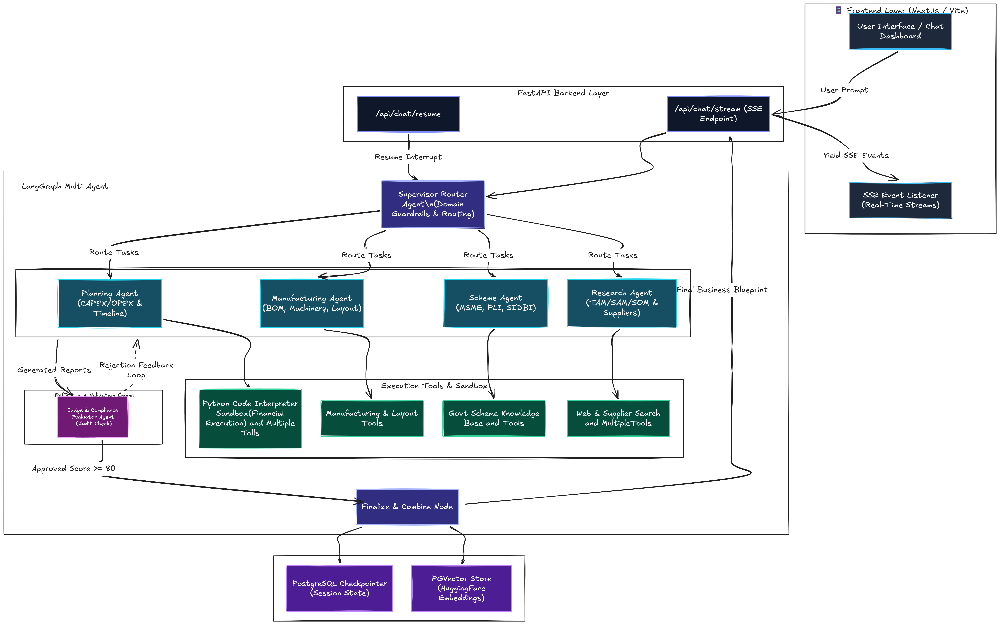
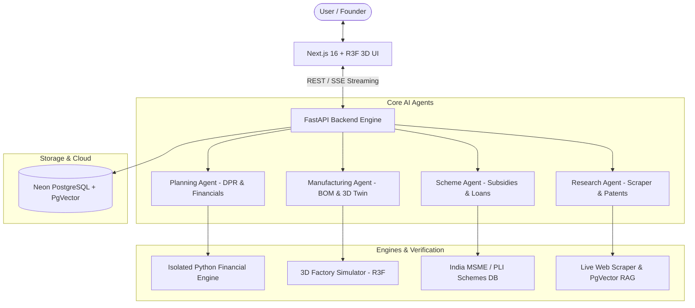

# 🏭 AI Copilot For Manufacturing StartUp

<!-- <p align="center">
    <h3>Team: Apex-X</h3>
</p> -->

> **An India-first, multi-agent AI platform designed to help manufacturing entrepreneurs plan, launch, and scale manufacturing businesses more effectively. The platform combines business planning, manufacturing intelligence, scheme discovery, and market research into a single decision-support system.**

[](https://fastapi.tiangolo.com/)
[](https://nextjs.org/)
[](https://www.langchain.com/)
[](https://www.langchain.com/langgraph)
[](https://threejs.org/)
[](https://render.com/)
[](https://vercel.com/)

---


---

## 📌 Problem Statement

Manufacturing entrepreneurs often struggle with fragmented information, limited expert guidance, and the lack of an integrated platform for end-to-end startup planning. Critical decisions such as business planning, process selection, factory setup, funding, supplier discovery, market research, and compliance are often spread across multiple portals, consultants, supplier websites, and technical documents.

### Existing Challenges

- **Execution Roadmaps**: Difficulty creating comprehensive business plans and detailed project reports (DPR).
- **Expert Guidance**: Limited access to expert guidance for selecting manufacturing processes, machinery, factory location, layout, and quality standards.
- **Funding & Subsidies**: Difficulty identifying suitable government schemes, subsidies, loans, and funding opportunities.
- **Supplier Sourcing**: Time-consuming search for reliable machinery suppliers and raw material vendors.
- **Market Intelligence**: Lack of integrated market research, competitor analysis, and demand forecasting.
- **Regulatory Compliance**: Complex compliance involving BIS, ISO, MSME, Startup India, GST, pollution, and other approvals.
- **Scattered Data**: Disjointed information sources that make informed decision-making difficult.

---

## 💡 Solution Overview

The proposed solution is a multi-agent AI manufacturing copilot built using Large Language Models (LLMs), multi-agent orchestration, Retrieval-Augmented Generation (RAG), and domain-specific knowledge bases. Its goal is to guide entrepreneurs through every stage of establishing a manufacturing business.

---

## 🤖 Core AI Agents

### 🎯 1. Planning Agent
- Business plan and DPR (Detailed Project Report) generation
- CAPEX/OPEX and ROI analysis
- Project timeline and risk assessment

### 🏭 2. Manufacturing Agent
- Manufacturing process selection
- Machinery recommendation & BOM generation
- Factory location and layout planning (including 3D Digital Twin visualization)
- Quality standards & utility requirements

### 🏛️ 3. Scheme Agent
- Government schemes, MSME, PLI, and subsidy discovery
- Loan recommendations (SIDBI, CGTMSE, Stand Up India)
- Eligibility analysis
- Funding opportunities

### 🔍 4. Research Agent
- Market research & TAM/SAM/SOM estimation
- Competitor analysis
- Supplier & vendor discovery
- Patent and industry report search

---

## 🔥 Key Features

- **Self-Correcting Multi-Agent AI**: Collaborative validation and multi-step reasoning for improved accuracy.
- **Python Financial Engine**: Isolated Python execution for precise financial calculations (IRR, NPV, ROI, break-even, loan schedules).
- **AI Quality & Compliance Validation**: Automatic auditing against BIS standards, ISO requirements, government scheme eligibility, and financial consistency.
- **Manufacturing Intelligence**: Automated BOM generation, machinery recommendations, factory layout design, utilities, and workflow orchestration.
- **India-First Scheme Engine**: Comprehensive coverage of MSME, Startup India, SIDBI, CGTMSE, PLI, and state-specific incentives.
- **Market Intelligence**: Supplier discovery, competitor analysis, patent search, and TAM/SAM/SOM market estimation.
- **Real-Time Interactive AI & 3D Digital Twin**: Live SSE streaming chatbot, 3D factory visualization (Three.js), and human-in-the-loop controls.

---

## 🎯 Key Benefits

- 🎯 **100% Math Precision** through isolated Python execution for reliable calculations.
- ⚡ **95% Faster Planning** by reducing weeks or months of research into minutes.
- 💰 **Reduced Consultancy Costs** through automation of planning, manufacturing, and financial analysis.
- 🏛️ **Government Funding Optimization** by identifying relevant schemes, subsidies, grants, and loans.
- 📄 **Bank-Ready Reports** for loan applications and investor presentations.

---

## 🏗️ Architecture

Below is the system architecture and workflow diagram representing the end-to-end design of the multi-agent manufacturing copilot:



### System Workflow Diagram (Mermaid)



---

## 🛠️ Tech Stack

### **Frontend**
- **Framework**: Next.js 16 (App Router, Turbopack)
- **Styling**: Tailwind CSS 4, Glassmorphism UI, Lucide Icons
- **3D Graphics**: Three.js, `@react-three/fiber`, `@react-three/drei`
- **State Management**: Zustand, TanStack React Query

### **Backend**
- **Framework**: FastAPI (Python 3.12, Uvicorn)
- **Agent Orchestration**: LangChain, LangGraph, LangGraph Checkpoint
- **LLM Engines**: Google Gemini, Groq, OpenRouter, Nvidia AI, Mistral AI, Cerebras
- **Database & Vectors**: PostgreSQL (Neon Tech), SQLAlchemy, PgVector, `psycopg2-binary`
- **Package Manager**: `uv` & `pip`

### **Deployment**
- **Backend Service**: Render (Python 3.12 Runtime / Docker)
- **Frontend Hosting**: Vercel (Edge Network)

---

## 🚀 Getting Started Locally

### Prerequisites
- Python >= 3.12
- Node.js >= 20
- PostgreSQL database (or Neon PostgreSQL URI)

---

### 1. Clone the Repository
```bash
git clone https://github.com/abhisheksssss/Ai-Copilot-For-Manufacturing-Startup.git
cd Ai-Copilot-For-Manufacturing-Startup
```

### 2. Backend Setup
```bash
cd backend

# Create virtual environment & install dependencies
python -m venv .venv
source .venv/bin/activate  # On Windows: .venv\Scripts\activate
pip install -r requirements.txt

# Configure Environment Variables
# Copy .env.example or create .env with your API keys and DATABASE_URL

# Run FastAPI Dev Server
uvicorn main:app --reload --port 8000
```
Backend API will run at `http://localhost:8000` (Swagger Docs at `/docs`).

---

### 3. Frontend Setup
```bash
cd ../frontend

# Install node dependencies
npm install

# Run Development Server
npm run dev
```
Frontend app will run at `http://localhost:3000`.

---

## ☁️ Cloud Deployment

### **Deploying Backend to Render**
1. Create a **New Web Service** on Render connected to `backend`.
2. Root Directory: `backend`
3. Build Command: `pip install -r requirements.txt`
4. Start Command: `uvicorn main:app --host 0.0.0.0 --port $PORT`
5. Add Environment Variables (`DATABASE_URL`, `ALLOWED_ORIGINS=https://*.vercel.app`, API Keys).

### **Deploying Frontend to Vercel**
1. Import repository into Vercel and set Root Directory to `frontend`.
2. Set Environment Variable `NEXT_PUBLIC_API_URL` to your Render backend URL (`https://your-backend.onrender.com`).
3. Click **Deploy**.

---

## 🎯 Conclusion

The AI Manufacturing Copilot simplifies the journey from idea to factory setup by integrating planning, manufacturing guidance, government scheme support, and market research into one intelligent platform. It enables faster, data-driven, and cost-effective decision-making while reducing dependence on multiple consultants.

---

## 🌏 Impact on Society

- 🏭 **Promotes Manufacturing & Innovation**: Empowers new startups to enter core manufacturing sectors.
- 💡 **Encourages Entrepreneurship**: Simplifies technical barriers to entry for aspiring founders.
- 💼 **Generates Direct & Indirect Employment**: Drives job creation across factory operations and supply chains.
- 🇮🇳 **Strengthens the MSME Ecosystem**: Boosts local production in alignment with Make in India initiatives.
- 🏛️ **Improves Access to Government Resources**: Connects founders with schemes, subsidies, grants, and SIDBI/CGTMSE loans.
- 📈 **Drives Economic Growth**: Accelerates startup scaling and industrial development.
- 🎓 **Democratizes Expert Knowledge**: Provides tier-2/3 founders access to elite industrial consulting capabilities.
- 🌿 **Supports Sustainable Growth**: Optimizes factory layouts and resource usage for operational efficiency.

---


